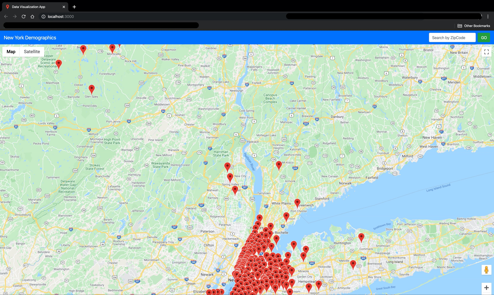

# ReactJS-GoogleMap-Chart.js-Integration

Setting up the Project:
1) Run "npm install" in the extracted folder
2) Run "npm start" to view the project on local server.
3) Create a google API by logging into google cloud console and use it in MapContainer.js

The primary dataset for this project is New York City's "Demographic Statistic by Zip Code" dataset, which can be downloaded in various forms from the following location:

https://catalog.data.gov/dataset/demographic-statistics-by-zip-code-acfc9

For a list of zip codes and their latitude and longitude needed for geocoding, the following dataset is used.
https://public.opendatasoft.com/explore/dataset/us-zip-code-latitude-and-longitude/information/
